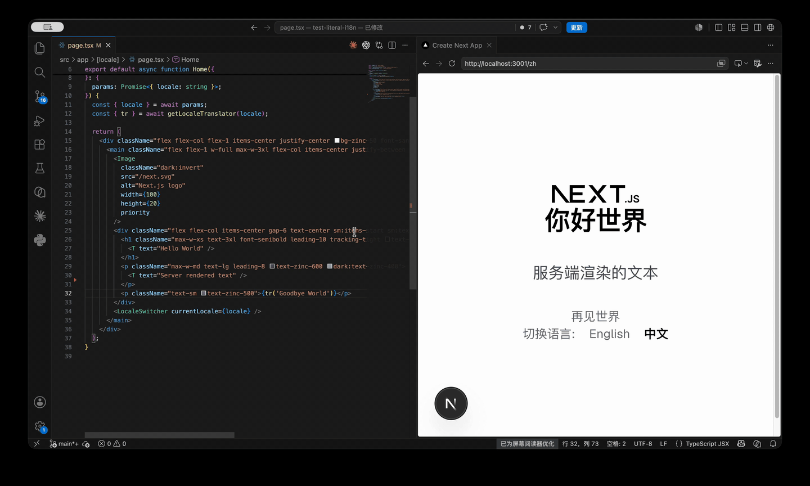

# Literal I18n

[中文](README.md) | [English](README.en.md) | [GitHub](https://github.com/gguser1995-spec/literal-i18n) | [Gitee](https://gitee.com/lwfux/literal-i18n)

Literal I18n 是一个面向 React / Next.js 的字面量国际化工具。你直接在组件里写原文，插件负责 AST 扫描、生成稳定 key、补齐语言 JSON，并在运行时按当前路由加载需要的翻译。

当前版本：`0.2.9`

## 设计理念

传统 i18n 的第一步通常是先设计 key，例如 `home.hero.title`，再把真实文案放到语言文件里。Literal I18n 反过来：开发者先把真实文案写进代码，工具从源码中识别这些字面量，再生成可维护的翻译资产。

它希望解决三个问题：

- 开发时少想一层 key，直接写 `<T text="Hello {name}" />`。
- 发布前仍然保留工程化产物，语言 JSON、source map、manifest 都是明确文件。
- 翻译管理可以从代码工作流里拆出来，通过本地 GUI 交给产品、运营、翻译或审核人员处理。

推荐生产项目使用 `hash` key。这样代码里保留可读原文，语言文件里使用稳定短 key，避免长文案、标点调整或重复语境带来的维护噪音。

## 和传统 i18n 对比

| 维度 | 传统 i18n | Literal I18n |
| --- | --- | --- |
| 开发入口 | 先维护 key，再写 `t('home.title')` | 直接写 `<T text="Home" />` 或 `tr('Home')` |
| key 维护 | 依赖人工命名和目录规范 | AST 自动生成，支持 `source` / `hash` |
| 缺失翻译 | 通常在运行时或构建时报错/回退 | 抽取阶段识别缺失项，可自动调用翻译 hook |
| 重复原文 | 需要人工拆 key | 可通过 `id` 区分语境 |
| 运行时数据 | 容易按语言全量加载 | 可通过 middleware/proxy + manifest 按当前路由裁剪 |
| 翻译管理 | 多数依赖外部平台或手改 JSON | 内置本地 GUI，可筛选、清空、重翻译、删除 AST 未使用项 |
| 接入成本 | 需要约定 key 体系 | `npx literal-i18n init --yes` 优先自动接入 |

Literal I18n 不试图替代所有大型 TMS 平台。它更适合希望在代码仓库内闭环管理翻译、同时又不想牺牲工程确定性的团队。

## 开发使用示例

组件里直接使用原文：

```tsx
import { T } from 'literal-i18n';

export function UserLine({ name }: { name: string }) {
  return <T text="Hello {name}" name={name} />;
}
```

`<T />` 的占位符也可以传 React 节点，适合给某个变量片段加样式或链接：

```tsx
<T
  text="my name {name}"
  name={<span className="text-red-400">lili</span>}
/>
```

在 Client Component 中获取字符串：

```tsx
'use client';

import { useTranslate } from 'literal-i18n';

export function SaveButton() {
  const { tr } = useTranslate();

  return <button>{tr('Save')}</button>;
}
```

在 Server Component 或服务端逻辑中使用：

```ts
import { getLocaleTranslator } from 'literal-i18n/server';

export async function getTitle(locale: string) {
  const { tr } = await getLocaleTranslator(locale);

  return tr('Dashboard');
}
```

Next.js App Router 推荐在 locale layout 中注入 Provider：

```tsx
import { I18nProvider } from 'literal-i18n';
import { getI18nProviderProps } from 'literal-i18n/server';

export default async function LocaleLayout({
  children,
  params,
}: {
  children: React.ReactNode;
  params: Promise<{ locale: string }>;
}) {
  const { locale } = await params;
  const i18n = await getI18nProviderProps(locale);

  return <I18nProvider {...i18n}>{children}</I18nProvider>;
}
```

同一个 `import { T } from 'literal-i18n'` 会根据运行环境自动切换实现：

- Server Component 中的 `<T />` 使用 server 版实现，在 RSC 渲染阶段直接输出目标语言文本。
- Client Component 中的 `<T />` 使用 client 版实现，从 `I18nProvider` 读取 messages。

这意味着软跳到目标页面时，Server Component 文案会随目标页面 RSC payload 一起到达，不需要等待额外的客户端补包请求。

获取当前语言：

```tsx
'use client';

import { useI18n, useTranslate } from 'literal-i18n';

export function LocaleBadge() {
  const { locale } = useI18n();
  const { locale: sameLocale, tr } = useTranslate();

  return <span title={sameLocale}>{tr('Current language')}: {locale}</span>;
}
```

在 Server Component 中，最稳定的方式是从 App Router 的 `params.locale` 读取当前语言，并把它传给服务端 helper：

```tsx
import { getLocaleTranslator } from 'literal-i18n/server';

export default async function Page({
  params,
}: {
  params: Promise<{ locale: string }>;
}) {
  const { locale } = await params;
  const { tr } = await getLocaleTranslator(locale);

  return <h1>{tr('Dashboard')}</h1>;
}
```

如果项目的 middleware 已写入 locale header，也可以用 `getTranslator()` 自动读取请求语言；读不到时会回退到默认 `en`：

```ts
import { getTranslator } from 'literal-i18n/server';

export async function getServerCopy() {
  const { locale, tr } = await getTranslator();

  return { locale, title: tr('Dashboard') };
}
```

相同原文但语境不同，可以加 `id`：

```tsx
<T text="Post" id="button" />
<T text="Post" id="noun" />
```

## GIF 图效果



GIF 展示的是开发态从源码字面量到翻译文件生成的基本流程。真实项目中，建议配合 `literal-i18n gui` 管理翻译结果，配合 runtime manifest 控制当前路由 payload。

## 安装（CLI 安装优先）

新项目推荐从 CLI 初始化开始：

```bash
npx literal-i18n init --yes
```

如果想先预览会修改哪些文件：

```bash
npx literal-i18n init --dry-run
```

注意：`npx literal-i18n init` 不带 `--yes` 时只打印计划，不会写入文件。文档优先写 `npx literal-i18n init --yes`，就是为了避免接入时误以为已经生效。

如果你希望先手动安装依赖：

```bash
npm install literal-i18n
npx literal-i18n init --yes
```

项目依赖安装后，裸命令 `literal-i18n init` 通常不会出现在全局 shell PATH 中。请使用 `npx literal-i18n init --yes`、`npm exec literal-i18n -- init --yes`，或在 `package.json` scripts 里调用。

`init` 会保守地检测并生成：

- `literal-i18n.config.ts`
- `src/messages/`
- `.env.example`
- `package.json` 中的 `i18n:extract`、`i18n:watch`、`build` 脚本
- Next.js 15 的 `src/middleware.ts`，或 Next.js 16 的 `src/proxy.ts`
- `src/app/api/literal-i18n/messages/route.ts`，用于客户端软跳时按路由补充 messages
- 简单 `next.config.ts/mjs/js` 的 `withLiteralI18n(...)` 包装

如果项目里已经有 `next.config`、`middleware` 或 `proxy`，`init` 不会盲目覆盖。简单配置会自动合并，复杂配置会输出手动合并建议。重复执行 `init` 不会重复插入同一段配置。

生成的默认配置包含 DeepSeek `translateJsonHook`。当 `.env` / `.env.local` 没有 `LITERAL_I18N_API_KEY` 时，它只抽取不自动翻译；填入 key 后会自动翻译缺失目标语言。

```ts
import { defineLiteralI18nConfig } from 'literal-i18n/next';
import { createDeepSeekTranslateJsonHook } from 'literal-i18n/local-translate-api';

export default defineLiteralI18nConfig({
  sourceDir: 'src',
  sourceOutput: 'src/messages/en.json',
  sourceMapOutput: 'src/messages/source-map.json',
  localeDir: 'src/messages',
  locales: ['en', 'zh'],
  sourceLocale: 'en',
  keyMode: 'hash',
  idPrefix: 'm_',
  idLength: 16,
  async translateJsonHook(input) {
    const apiKey = process.env.LITERAL_I18N_API_KEY;
    if (!apiKey) return {};

    return createDeepSeekTranslateJsonHook({
      baseUrl: 'https://api.deepseek.com',
      apiKey,
      model: 'deepseek-v4-flash',
      batchSize: 20,
      timeoutMs: 120000,
      temperature: 0.1,
      prompt: 'Translate concise UI copy. Keep placeholders unchanged.',
    })(input);
  },
});
```

## GUI 管理介绍

启动本地翻译管理页面：

```bash
npx literal-i18n gui
```

默认地址：

```txt
http://127.0.0.1:3699
```

指定端口：

```bash
npx literal-i18n gui --port 3700
```

GUI 面向“翻译管理”而不是“开发配置”。它会读取当前项目的 `literal-i18n.config.*`、语言 JSON、`source-map.json`、`manifest.json` 和 AST cache。

当前支持：

- 按页面 URL、源码片段、语言、key、文案搜索组合筛选。文案搜索会按当前选择的语言查对应 JSON 值，例如选择 `zh` 时搜索中文译文，选择源语言时搜索原文。
- 查看只读 `source-map.json`。
- 查看和编辑目标语言 JSON，例如 `zh.json`、`de.json`。
- 单项清空译文。清空不会删除 key，只会把值改为空字符串，避免破坏结构。
- 单项重翻译。
- 显示不在 AST 中的 key:value。
- 删除 AST 未使用项。
- 一键剔除多余 key:value，并同步处理 source-map 和各语言 JSON。

删除能力有明确边界：只有不在最新 AST 扫描结果中的 key 才允许删除，删除前服务端会重新读取 AST cache 二次校验。AST cache 不存在时，GUI 会禁止删除，避免误删仍在代码里使用的文案。

这个方向适合把 GUI 链接交给专业人员处理翻译：开发者负责写真实文案和提交结构，翻译人员负责补齐、重翻译和清理无效项。

## 其他详细介绍

### CLI 抽取

```bash
npx literal-i18n extract
```

旧命令仍然保留：

```bash
npx literal-i18n-extract
```

指定配置文件：

```bash
npx literal-i18n extract --config ./literal-i18n.config.ts
```

临时覆盖配置：

```bash
npx literal-i18n extract src \
  --out src/messages/en.json \
  --source-map-out src/messages/source-map.json \
  --key-mode hash \
  --id-prefix m_ \
  --id-length 16 \
  --locales en,zh,de \
  --source-locale en
```

配置优先级：

```txt
命令行参数 > NEXT_PUBLIC_LITERAL_I18N_* 环境变量 > literal-i18n.config.* > 默认值
```

Watch 模式：

```bash
npx literal-i18n extract --watch
```

使用 `withLiteralI18n` 时，开发态默认会启动内置 watcher。它会在项目启动时扫描一次，源码变化时增量扫描一次。显式使用 `next dev --webpack` 时，默认改由 webpack watch hook 抽取；如果仍想启动时立即扫描，可以配置 `devWatch: true`。

`withLiteralI18n` 默认会把 `localeDir` 下的 JSON 文件同步到 `public/literal-i18n/messages`。Next.js 会把 `public` 目录作为静态资源发布，因此 `public/literal-i18n/messages/zh.json` 会以 `/literal-i18n/messages/zh.json` 暴露，不需要额外上传 `src/messages`。

运行时读取顺序：

- 开发环境优先读 `localeDir`，保证本地抽取后的 JSON 立即生效；如果不存在，再读 `public/literal-i18n/messages`。
- 生产环境优先读 `public/literal-i18n/messages`，避免先访问源码目录造成无意义 IO；如果静态副本不存在，再兼容回退到 `localeDir`。

如果你不想生成 public 静态副本，可以在 `withLiteralI18n` / `literal-i18n.config.*` 中设置 `publicRuntime: false`。也可以用 `publicRuntimeDir` 修改静态副本目录，默认值是 `literal-i18n/messages`。

`npx literal-i18n init --yes` 会把 `/public/literal-i18n/messages` 加入 `.gitignore`。这份目录是构建/开发时生成的运行时副本，不需要手动维护。

### Next.js 插件

```ts
import type { NextConfig } from 'next';
import withLiteralI18n from 'literal-i18n/next';
import literalI18nConfig from './literal-i18n.config';

const nextConfig: NextConfig = {};

export default withLiteralI18n(nextConfig, {
  ...literalI18nConfig,
  // 可选：仅当配置文件不在 literal-i18n.config.* 默认路径时需要。
  // configPath: 'config/literal-i18n.config.cjs',
});
```

Next.js 16 推荐使用 `src/proxy.ts`：

```ts
import type { NextRequest } from 'next/server';
import { NextResponse } from 'next/server';
import { literalI18nMiddleware } from 'literal-i18n/middleware';

export function proxy(request: NextRequest) {
  return literalI18nMiddleware(request, NextResponse);
}

export const config = {
  matcher: ['/((?!_next|favicon.ico).*)'],
};
```

Next.js 15 使用 `src/middleware.ts`，内容相同，只是导出函数名通常为 `middleware`：

```ts
export function middleware(request: NextRequest) {
  return literalI18nMiddleware(request, NextResponse);
}
```

middleware/proxy 只把当前 pathname 和 locale 写入 request header，不读取 JSON，不做翻译。真正的消息裁剪发生在 `getI18nProviderProps(locale)` 内部；Server Component 里的 `<T />` 也会用这些 header 推断当前请求语言。

如果你的项目没有其他 middleware，直接使用 `literalI18nMiddleware(request, NextResponse)` 即可，不需要手动 import header 常量。

如果项目已经有 next-intl 或自定义 middleware，需要把 literal-i18n 的 pathname 和 locale header 合并进同一个 request。此时 `LITERAL_I18N_PATHNAME_HEADER` 和 `LITERAL_I18N_LOCALE_HEADER` 是必须的：

```ts
import type { NextRequest } from 'next/server';
import { NextResponse } from 'next/server';
import createMiddleware from 'next-intl/middleware';
import {
  LITERAL_I18N_LOCALE_HEADER,
  LITERAL_I18N_PATHNAME_HEADER,
} from 'literal-i18n/middleware';

const intlMiddleware = createMiddleware({
  locales: ['en', 'zh'],
  defaultLocale: 'en',
  localePrefix: 'always',
});

export function middleware(request: NextRequest) {
  const requestHeaders = new Headers(request.headers);
  const locale = request.nextUrl.pathname.split('/').filter(Boolean)[0];
  requestHeaders.set(LITERAL_I18N_PATHNAME_HEADER, request.nextUrl.pathname);
  if (locale) requestHeaders.set(LITERAL_I18N_LOCALE_HEADER, locale);

  return intlMiddleware(
    new NextRequest(request, {
      headers: requestHeaders,
    }),
  );
}
```

如果你有 `_rsc`、静态资源白名单、rewrite 或其他提前返回分支，也要保证需要裁剪和 server 翻译的页面请求不会绕过这些 header；否则运行时会因为拿不到 pathname/locale 而回退。

### 运行时按当前路由裁剪

抽取时会生成 `src/messages/manifest.json`，记录 App Router 路由、该路由下使用到的 message key，以及所有 Client Component 运行必需的 `clientKeys`。

默认情况下，`getI18nProviderProps(locale)` 只返回当前 pathname 匹配路由需要的 messages，再加上 `clientKeys`。页面 A 的首屏 HTML/RSC payload 不会包含页面 B 的 server-only 文案，但会包含 Client Component 在浏览器中运行必需的文案。

客户端从页面 A 软跳到页面 B 时，Server Component 文案会跟随目标页面 RSC payload 返回；Client Component 文案由 `clientKeys` 保证提前存在。`/api/literal-i18n/messages?locale=zh&pathname=/zh/create` 仍然保留为兼容兜底，用于自定义 loader、旧项目或特殊动态场景。

`init` 会自动生成默认 API route。已有项目可以手动添加：

```ts
// src/app/api/literal-i18n/messages/route.ts
export { literalI18nMessagesGET as GET } from 'literal-i18n/server';
```

如果你需要接入自己的权限、缓存或网关，可以自定义 loader：

```tsx
<I18nProvider
  {...i18n}
  loadMessages={(locale, pathname) =>
    fetch(`/custom/messages?locale=${locale}&pathname=${pathname}`).then((res) => res.json())
  }
  onRouteMessagesLoadingChange={(loading) => setLoading(loading)}
  routeMessagesFallback={<PageLoading />}
  routeMessagesFallbackCloseDelayMs={150}
>
  {children}
</I18nProvider>
```

如果只是改默认 endpoint，可以传 `messageEndpoint="/custom/messages"`。`routeMessagesFallback` 会在兜底补包期间替换 children；`routeMessagesFallbackCloseDelayMs` 控制补包完成后 fallback 延迟关闭时间，默认 `0`。如果你想做全局遮罩并保留 children 挂载状态，可以只使用 `onRouteMessagesLoadingChange` 自己渲染 overlay。

当以下条件同时满足时，`getI18nProviderProps(locale)` 会根据 manifest 裁剪 messages：

- 已存在 `manifest.json`。
- 已接入 `literalI18nMiddleware`。
- 当前 pathname 能匹配 manifest 中的路由。

缺少 middleware、缺少 manifest、路由未命中或 manifest 异常时，会自动回退到全量 messages。这个回退是为了保证页面可用，但验收时需要检查 HTML/RSC payload，避免误以为已经裁剪成功。

如果需要手动传 pathname，测试中可以这样写：

```ts
const i18n = await getI18nProviderProps('zh', {
  pathname: '/zh/about',
});
```

如果 `I18nProvider` 放在持久 layout 中，并且你更在意同语言客户端软跳时不缺 key，可以显式启用导航范围 payload：

```ts
const i18n = await getI18nProviderProps('zh', {
  pathname: '/zh/about',
  payloadScope: 'navigation',
});
```

`payloadScope: 'navigation'` 会把同一 locale 导航树下其它页面的 key 也下发到首屏源码中。追求严格剪枝时，请保持默认 `route`，或把 provider 放到会随页面切换刷新的边界中。

默认不会把完整 `source-map.json` 下发到客户端。如确实需要：

```ts
const i18n = await getI18nProviderProps('zh', {
  includeSourceMap: true,
});
```

### Hash Key 模式

默认 `source` 模式会把原文作为 key：

```json
{
  "Hello World": "你好世界"
}
```

生产推荐 `hash`：

```json
{
  "m_073083b5b1d08690": "你好世界"
}
```

`source-map.json` 会记录原文和 hash key 的关系，方便排查：

```json
{
  "Hello World": "m_073083b5b1d08690"
}
```

带 `id` 的相同原文会使用 `text + id` 生成不同 key：

```tsx
<T text="Post" id="button" />
<T text="Post" id="noun" />
```

### AST 抽取规则

默认识别这些入口：

```ts
import { T, useTranslate, createTranslator } from 'literal-i18n';
import { getTranslator, getLocaleTranslator } from 'literal-i18n/server';
```

支持静态字面量：

```tsx
<T text="Hello World" />
<T text="Post" id="button" />

const { tr } = useTranslate();
tr('Client text');
tr('Post', undefined, { id: 'button' });
```

不支持动态原文或动态 id：

```tsx
<T text={title} />
<T text={`Hello ${name}`} />
<T text="Post" id={type} />
tr(variable);
tr('Post', undefined, { id: type });
```

这些写法会在扫描时输出 warning。原因很明确：工具必须在 AST 阶段知道“真实原文”是什么，才能生成稳定翻译资产。

如果你封装了自己的入口，可以配置 import source：

```ts
export default withLiteralI18n(nextConfig, {
  importSources: ['literal-i18n', '@/components/i18n'],
});
```

### 翻译 Hook

推荐使用批量 `translateJsonHook`：

```ts
export default withLiteralI18n(nextConfig, {
  locales: ['zh'],
  sourceLocale: 'en',
  async translateJsonHook({
    locale,
    sourceLocale,
    missingTexts,
    missingMessages,
  }) {
    return myTranslateBatch({
      locale,
      sourceLocale,
      texts: missingTexts,
      messages: missingMessages,
    });
  },
});
```

返回值：

```ts
Record<string, string>
```

返回 key 可以是原文，也可以是生成后的 message key。对于带 `id` 的相同原文，推荐返回生成后的 message key，避免不同语境互相覆盖。

也可以逐条翻译：

```ts
export default withLiteralI18n(nextConfig, {
  async translateHook({ text, key, id, locale, sourceLocale }) {
    return myTranslateOne({ text, key, id, locale, sourceLocale });
  },
});
```

`treatSourceAsMissing` 默认是 `false`。也就是说目标语言译文和源文案相同，不会默认被当成缺失翻译。这个行为对德语、法语、西语等拉丁语体系很重要，因为它们本来就可能和英文一致。

### Demo

项目内置两个示例：

```bash
cd demo
npm install
npm run dev
```

```bash
cd demo-next-16
npm install
npm run dev
```

Demo 翻译功能依赖你自己的 DeepSeek API Key。请在 `.env.local` 中配置：

```env
LITERAL_I18N_API_KEY=your-api-key
```

Next.js 16 / Turbopack 下，翻译文件更新后页面可能需要手动刷新才能看到最新文案。

## API 文档

### `literal-i18n`

- `T`
- `I18nProvider`
- `useTranslate()`：返回 `{ locale, tr }`。
- `useI18n()`：返回 `{ locale, translate }`。
- `loadMessages(locale, pathname)`：客户端默认路由补包 loader，请求 `/api/literal-i18n/messages`。
- `onRouteMessagesLoadingChange` / `routeMessagesFallback`：`I18nProvider` 的软跳补包 loading 回调与 fallback。
- `DEFAULT_MESSAGE_ENDPOINT`
- `createTranslator(options)`
- `createMessageId(text, options)`
- `getMessageKey(text, options)`
- `getEnvMessageIdOptions()`
- `defaultTranslate`

### `literal-i18n/server`

- `loadMessages(locale, localeDir?)`
- `loadSourceMap(localeDir?)`
- `loadLiteralI18nManifest(localeDir?)`
- `loadLiteralI18nConfig(cwd?)`
- `getMessageStore(localeDir?)`
- `getI18nProviderProps(locale, options?)`
- `literalI18nMessagesGET(request)`：默认 Next.js route handler，可 `export { literalI18nMessagesGET as GET } from 'literal-i18n/server'`。
- `getTranslator(input?)`：返回 `{ locale, messages, tr }`，未显式传 locale 时会尝试从请求 header 读取。
- `getLocaleTranslator(locale, options?)`：返回 `{ locale, messages, tr }`。

`getI18nProviderProps` / `getTranslator` / `getLocaleTranslator` 常用 options：

- `localeDir`：消息目录，默认 `src/messages`。
- `publicRuntime`：是否启用 public 静态运行时副本，默认 `true`。
- `publicRuntimeDir`：public 下的静态副本目录，默认 `literal-i18n/messages`。
- `sourceMap`：手动传入 source map。
- `includeSourceMap`：仅 `getI18nProviderProps` 使用，默认 `false`。
- `optimizePayload`：仅 `getI18nProviderProps` 使用，默认 `true`。
- `payloadScope`：仅 `getI18nProviderProps` 使用，默认 `route`；可设为 `navigation` 启用同 locale 导航范围 payload。
- `pathname`：仅 `getI18nProviderProps` 使用，通常由 middleware/proxy 自动写入。
- `keyMode` / `idPrefix` / `idLength`：hash 模式配置，通常从配置文件自动读取。

### `literal-i18n/client-loader`

- `loadMessages(locale, pathname)`：默认客户端路由补包请求。
- `loadMessagesFromEndpoint(locale, pathname, endpoint)`：请求指定 endpoint。
- `normalizeLoadedMessages(payload)`：从 `{ messages }` 或直接 messages 对象中取出可合并数据。
- `DEFAULT_MESSAGE_ENDPOINT`

### `literal-i18n/middleware`

- `literalI18nMiddleware(request, NextResponse)`
- `LITERAL_I18N_PATHNAME_HEADER`
- `LITERAL_I18N_LOCALE_HEADER`

### `literal-i18n/next`

- `withLiteralI18n(nextConfig, options)`
- `defineLiteralI18nConfig(options)`
- `LiteralI18nNextPlugin`

常用 options：

- `sourceDir` / `sourceDirs`
- `sourceOutput`
- `sourceMapOutput`
- `manifestOutput`
- `localeDir`
- `publicRuntime`
- `publicRuntimeDir`
- `locales`
- `sourceLocale`
- `keyMode` / `idPrefix` / `idLength`
- `importSources` / `serverImportSources`
- `translateHook`
- `translateJsonHook`
- `onExtract`
- `keepStale`
- `treatSourceAsMissing`
- `pruneLegacySourceKeys`
- `progress` / `silent`
- `devWatch`

`devWatch`：

- `true`：开发态强制使用内置 watcher。
- `false`：开发态不自动扫描，需要手动运行 CLI 或 `extract --watch`。
- 未设置：开发态默认内置 watcher；显式 `next dev --webpack` 时走 webpack watch。

### `literal-i18n/local-translate-api`

- `createLocalTranslateJsonHook(options)`
- `createOpenAICompatibleTranslateJsonHook(options)`
- `createDeepSeekTranslateJsonHook(options)`

这些 helper 是可选能力。你可以接 DeepSeek、OpenAI-compatible API、自建服务，或者完全自己实现翻译 hook。

## 更新日志

详见 [CHANGELOG.md](CHANGELOG.md)。

`0.2.9` 的重点：

- 修复 Next.js 客户端切换页面时，补包监听同步触发状态更新导致 `useInsertionEffect must not schedule updates` 的问题。
- 默认把运行时 JSON 同步到 `public/literal-i18n/messages`，生产运行时优先读取 public 静态副本，减少部署环境对 `src/messages` 的依赖。
- 继续保留 `0.2.6` 的严格当前路由首屏剪枝、客户端路由补包、默认 `/api/literal-i18n/messages` route handler 和 `literal-i18n/client-loader`。

## 疑问提交

如果你遇到 Bug、有功能建议，或对配置/用法有疑问，请提交 Issue：

https://github.com/gguser1995-spec/literal-i18n/issues

提交问题时建议带上：

- `literal-i18n` 版本。
- Next.js / React 版本。
- `literal-i18n.config.*`。
- 相关页面路径。
- 语言 JSON、`source-map.json`、`manifest.json` 中的关键片段。
- 如果是 payload 问题，请提供页面 HTML/RSC 中实际出现的 message key。
